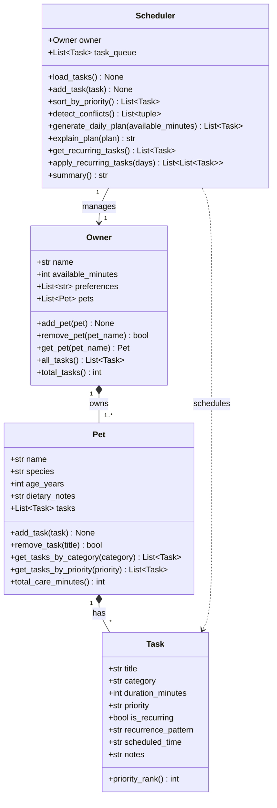

# PawPal+ Project Reflection

## 1. System Design

**a. Initial design**

Three core user actions the system must support:
1. **Add a pet** — register a pet's profile (name, species, age, dietary notes).
2. **Schedule a care task** — attach a task (walk, feeding, medication, etc.) to a pet with priority and optional time.
3. **View today's plan** — get an ordered, time-budgeted list of tasks with plain-English explanations.

Four classes were identified and their responsibilities assigned:

| Class | Responsibility |
|---|---|
| `Task` | A single care action. Stores title, category, duration, priority, recurrence, and an optional preferred time. Knows how to rank itself for sorting. |
| `Pet` | A pet profile. Owns a list of Tasks. Provides helpers to filter by category/priority and calculate total care minutes. |
| `Owner` | A pet owner. Owns a list of Pets and tracks their daily time budget and category preferences. Aggregates all tasks across pets. |
| `Scheduler` | The logic layer. Takes an Owner, loads all tasks into a queue, sorts by priority, detects time-window conflicts, and generates + explains a daily plan. |

Relationships:
- `Owner` **has many** `Pet` instances (composition).
- `Pet` **has many** `Task` instances (composition).
- `Scheduler` **manages** one `Owner` and operates on the flat task list derived from it.

**Mermaid.js UML diagram:**

**b. Design changes**

Two design changes were made during implementation:

1. **`completed` flag added to `Task`** — The original UML had no completion state. Once `mark_complete()` was needed for the UI checkboxes and the `filter_tasks(completed=False)` filter, a boolean `completed` field was added to the dataclass. This is a natural extension that the UML omitted.

2. **`due_date` + `next_occurrence()` added to `Task`** — The original design treated recurrence as a simple label string. In Phase 4, recurring tasks needed to compute an actual next date using `timedelta`. Rather than putting this logic in the Scheduler (which would have needed to know the date arithmetic), it was added directly to `Task` so each task owns its own scheduling math. This keeps the Scheduler focused on ordering and filtering.

---

## 2. Scheduling Logic and Tradeoffs

**a. Constraints and priorities**

The scheduler considers three constraints, in order of importance:

1. **Mandatory category** — Any task with `category == 'medication'` is always included regardless of budget. Missing medication is the highest-risk outcome for a pet owner.
2. **Time budget** — `Owner.available_minutes` acts as a hard cap. The greedy algorithm fills the budget from highest to lowest priority, stopping when no remaining task fits.
3. **Priority level** — Within the budget, `high` tasks are selected before `medium` and `low`. Ties are broken by duration (shorter first) to maximise the number of tasks that fit.

Mandatory status was ranked above time budget because the cost of skipping medication is potentially medical harm, whereas skipping a grooming session has no health consequence.

**b. Tradeoffs**

**Tradeoff: interval-overlap conflict detection vs. exact-time-match only**

The conflict detector checks whether two tasks' time windows `[start, start + duration)` overlap, rather than just flagging tasks at identical start times. This catches realistic conflicts — e.g., a 30-minute walk starting at 07:30 overlaps with a feeding starting at 07:45 — and is still O(n²) in the number of timed tasks.

The tradeoff is that the algorithm has no awareness of *which pet* the tasks belong to. Two tasks for different pets that overlap are still flagged as conflicts, even though a real owner could handle them simultaneously. This is a safe over-approximation: it produces false positives (extra warnings) but never misses a genuine conflict. For a solo-owner app with a small task count (<20), the false-positive rate is acceptable and the simplicity of the implementation is worth it.

---

## 3. AI Collaboration

**a. How you used AI**

- How did you use AI tools during this project (for example: design brainstorming, debugging, refactoring)?
- What kinds of prompts or questions were most helpful?

**b. Judgment and verification**

- Describe one moment where you did not accept an AI suggestion as-is.
- How did you evaluate or verify what the AI suggested?

---

## 4. Testing and Verification

**a. What you tested**

The test suite covers 72 cases across 8 areas:

1. **Sorting correctness** (`TestSortByTime`) — verifies that `sort_by_time()` returns tasks in ascending HH:MM order, places untimed tasks after all timed ones, and does not mutate the queue. Tasks were added deliberately out of order to confirm the sort isn't just preserving insertion order.

2. **Recurrence logic** (`TestRecurrence`) — confirms `next_occurrence()` returns tomorrow for "daily", +7 days for "weekly", and the same day for "twice daily". Uses a fixed `from_date` parameter so tests aren't sensitive to the wall clock. Also verifies that non-recurring tasks return `""`.

3. **Conflict detection** (`TestConflicts`) — verifies partial overlap, full containment, exact same start time, 3-way overlaps, and the boundary condition where adjacent tasks (`[08:00, 08:30)` and `[08:30, ...)`) do NOT conflict. Also checks that `conflict_warnings()` returns strings naming both tasks.

4. **Filtering** (`TestFilterTasks`) — verifies AND-combination of pet name, completion status, and category filters; confirms no mutation of the underlying queue.

5. **Edge cases** (`TestEdgeCases`) — empty pets, empty owner, zero-minute budget (only meds allowed through), single task that fits vs. doesn't fit, no recurring tasks returns empty list.

These tests matter because the greedy scheduler, conflict detector, and filter logic all have subtle boundary conditions. Without tests, it would be easy to ship a planner that silently drops medication tasks or incorrectly flags non-overlapping tasks as conflicts.

**b. Confidence**

**4 / 5 stars.** All 72 tests pass. The core algorithms (sort, filter, plan generation, conflict detection, recurrence) are thoroughly covered on both happy paths and edge cases. The remaining gap is Streamlit UI integration — testing that `st.session_state` correctly persists `Owner` and `Scheduler` objects across re-renders requires Streamlit's `AppTest` framework, which is the logical next testing investment.

Edge cases to add with more time:
- An owner with 10+ pets and 50+ tasks (performance/stress test of the O(n²) conflict detector)
- Tasks where `duration_minutes == 0`
- Malformed `scheduled_time` strings (e.g. `"8:0"`, `"noon"`) to verify graceful fallback in `scheduled_start_minutes()`

---

## 5. Reflection

**a. What went well**

- What part of this project are you most satisfied with?

**b. What you would improve**

- If you had another iteration, what would you improve or redesign?

**c. Key takeaway**

- What is one important thing you learned about designing systems or working with AI on this project?
