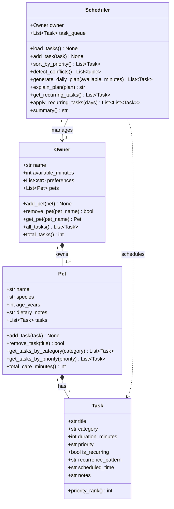

# PawPal+ Project Reflection

## 1. System Design

**a. Initial design**

Three core user actions the system must support:
1. **Add a pet** — register a pet's profile (name, species, age, dietary notes).
2. **Schedule a care task** — attach a task (walk, feeding, medication, etc.) to a pet with priority and optional time.
3. **View today's plan** — get an ordered, time-budgeted list of tasks with plain-English explanations.

Four classes were identified and their responsibilities assigned:

| Class | Responsibility |
|---|---|
| `Task` | A single care action. Stores title, category, duration, priority, recurrence, and an optional preferred time. Knows how to rank itself for sorting. |
| `Pet` | A pet profile. Owns a list of Tasks. Provides helpers to filter by category/priority and calculate total care minutes. |
| `Owner` | A pet owner. Owns a list of Pets and tracks their daily time budget and category preferences. Aggregates all tasks across pets. |
| `Scheduler` | The logic layer. Takes an Owner, loads all tasks into a queue, sorts by priority, detects time-window conflicts, and generates + explains a daily plan. |

Relationships:
- `Owner` **has many** `Pet` instances (composition).
- `Pet` **has many** `Task` instances (composition).
- `Scheduler` **manages** one `Owner` and operates on the flat task list derived from it.

**Mermaid.js UML diagram:**

**b. Design changes**

- Did your design change during implementation?
- If yes, describe at least one change and why you made it.

---

## 2. Scheduling Logic and Tradeoffs

**a. Constraints and priorities**

- What constraints does your scheduler consider (for example: time, priority, preferences)?
- How did you decide which constraints mattered most?

**b. Tradeoffs**

- Describe one tradeoff your scheduler makes.
- Why is that tradeoff reasonable for this scenario?

---

## 3. AI Collaboration

**a. How you used AI**

- How did you use AI tools during this project (for example: design brainstorming, debugging, refactoring)?
- What kinds of prompts or questions were most helpful?

**b. Judgment and verification**

- Describe one moment where you did not accept an AI suggestion as-is.
- How did you evaluate or verify what the AI suggested?

---

## 4. Testing and Verification

**a. What you tested**

- What behaviors did you test?
- Why were these tests important?

**b. Confidence**

- How confident are you that your scheduler works correctly?
- What edge cases would you test next if you had more time?

---

## 5. Reflection

**a. What went well**

- What part of this project are you most satisfied with?

**b. What you would improve**

- If you had another iteration, what would you improve or redesign?

**c. Key takeaway**

- What is one important thing you learned about designing systems or working with AI on this project?
