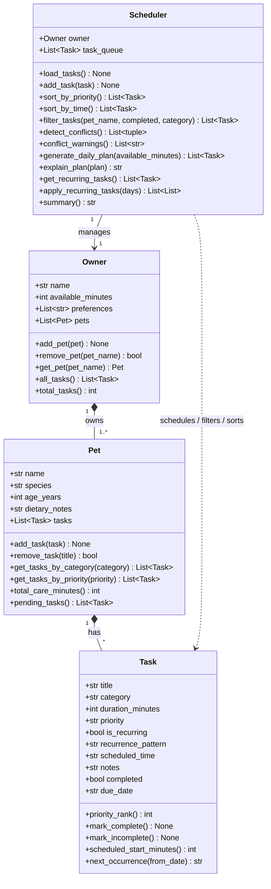

# PawPal+ — Final UML Class Diagram

This diagram reflects the **final implementation** in `pawpal_system.py` after all six project phases.
Paste the Mermaid code block into the [Mermaid Live Editor](https://mermaid.live) to render the diagram, or preview it in VS Code with the Mermaid Preview extension.

---

---

## Key changes from Phase 1 UML

| Change | Reason |
|---|---|
| Added `Task.completed: bool` | Required for `mark_complete/incomplete` and `filter_tasks(completed=...)` |
| Added `Task.due_date: str` | Stores computed next-occurrence date from `next_occurrence()` |
| Added `Task.next_occurrence(from_date)` | Recurring task date arithmetic using `timedelta`; placed on Task so it owns its own scheduling math |
| Added `Scheduler.sort_by_time()` | Sort by HH:MM wall-clock, untimed tasks last |
| Added `Scheduler.filter_tasks(pet_name, completed, category)` | AND-filtered view of the task queue without mutation |
| Added `Scheduler.conflict_warnings()` | Human-readable strings wrapping `detect_conflicts()` for UI display |
| Added `Pet.pending_tasks()` | Convenience helper filtering out completed tasks |
